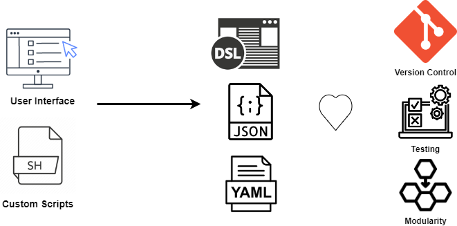

# Configuration Management
## What is Configuration Management
Is the process of maintaining servers, VMs or computers changes in a desired, consistent state. Removing the need of configure them manually or through customs scripts, reducing complexity and errors. **Making systems configuration  predicable and scalable.** 

These tools help you install and manage software on existing cloud infrastructure, either for bootstrapping a virtual machine, or patching one. For example, start and stop services; install or update applications; implement a security policy; or perform a wide variety of other configuration tasks.\

**NOTE: They do not attempt to solve the problem of provisioning or updating infrastructure. In that case use Infrastructure as Code tools such as Terrafom.**


<div align="center">
    
</div>


Configuration management is essential to establishing a reliable, consistent, and well-maintained IT environment at scale. Rather than relying on individuals to perform time-consuming manual configuration tasks, automation allows teams to consistently deploy and configure components in less time, with fewer human-interaction reducing mistakes. It also makes it possible to maintain consistent system settings across different environments (dev, staging, production) for an application’s life cycle, minimizing both performance and security issues.


### Benefits of using Configuration Management

Configuration management tools help developers keep track of the current state of applications and services. Typical them help teams to:
* Classify and manage systems by groups and subgroups. 
* Centrally modify base configurations.
* Roll out new settings to all applicable systems. 
* Automate system identification, patches, and updates.
* Identify outdated, poorly performing, and noncompliant configurations. 
* Prioritize necessary actions. 
* Access and apply prescriptive remediation.

### Configuration Management concepts
Configuration Management is based on Infrastructure as Code principles.
* Declarative files
* Version Control
* Testing
* State Management
* Modularity
* Parallel Deployment
* Assemble configurations to represent a specific version 

# Common Tools

## Ansible

Ansible is a simple IT automation engine that automates configuration management, application deployment, intra-service orchestration, and many other IT needs.

Being designed for multi-tier deployments since day one, Ansible models your IT infrastructure by describing how all of your systems inter-relate, rather than just managing one system at a time.

It uses no agents and no additional custom security infrastructure, so it’s easy to deploy - and most importantly, it uses a very simple language (YAML, in the form of Ansible Playbooks) that allow you to describe your automation jobs in a way that approaches plain English.

Ansible works by connecting to your nodes and pushing out scripts called “Ansible modules” to them. Most modules accept parameters that describe the desired state of the system. Ansible then executes these modules (over SSH by default), and removes them when finished. Your library of modules can reside on any machine, and there are no servers, daemons, or databases required.

### Inventory
By default, Ansible represents the machines it manages in a file (INI, YAML, and so on) that puts all of your managed machines in groups of your own choosing.

```yaml
---
[webservers]
web1.example.com
web2.example.com
172.10.0.20

[dbservers]
db0.example.com
db1.example.com
```

### Dynamic Inventory

If there’s another source of truth in your infrastructure, Ansible can also connect to that. Ansible can draw inventory, group, and variable information from sources like EC2, Rackspace, OpenStack, and more.

### Ansible Benefits


* Application Deployment: Ansible makes DevOps process easier by automating the deployment of internally developed applications to your environment systems. Ansible lets you quickly and easily deploy multi-tier apps. You won’t need to write custom code to automate your systems; you list the tasks required to be done by writing a playbook, and Ansible will figure out how to get your systems to the state you want them to be in. In other words, you won’t have to configure the applications on every machine manually.
* Orchestration: With application deployment, you need to manage front-end, back-end services, databases, networks, storage, and so on. Also, you need to make sure that all the tasks are handled in the proper order.
* Ansible uses automated workflows, provisioning, and more to make orchestrating tasks easy. Once you’ve defined your infrastructure using the Ansible playbooks, you can use that same orchestration wherever you need to.
*   Security and Compliance: As with application deployment, site-wide security policies (e.g. firewall rules) can be implemented along with other automated processes. If you configure the security details on the control machine and run the associated playbook, all the remote hosts will automatically be updated with those details. That means you won’t need to monitor each machine for security compliance continually manually.
*   Cloud Provisioning: With Ansible, you can provision cloud platforms, virtualized hosts, network devices, and bare-metal servers.

Chef

Puppet

## Key Concepts
## Workshop

```
apt-get -y install ansible
ansible-galaxy collection install community.docker
docker run -dit --name test1 ubuntu
docker run -dit --name test2 ubuntu
ansible-inventory --graph -i docker.yaml
ansible-inventory -i docker.yaml -v --list


plugin: community.docker.docker_containers
docker_host: unix://var/run/docker.sock
verbose_output: true
debug: true
keyed_groups:
  - prefix: ''
    separator: ''
    key: 'docker_config.Image'
leading_separator: false

```