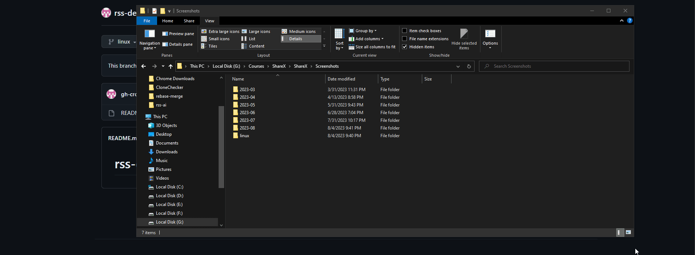

# How to create GitHub repository and add evidence of completing task to it

## Register GitHub account

1) Open in your browser https://github.com/.  
2) Click "Sign Up" button in right top corner.  
  
3) Enter your e-mail, click "Continue", enter your password, click "Continue", enter your username, click "Continue", answer the question - you could type "n", click "Continue". Click "Verify", solve a puzzle and click "Submit". After that click "Create account" button.  
  
4) Check your e-mail inbox for GitHub launch code.  
  
5) Open e-mail and click "Open GitHub" button or link down below.  
  
6.1) Enter code from e-mail to the form.  
  
6.2) Registration is completed.  
  

## Creating repository  
1) You could click plus button at the top (1) and click at "New repository" (2).  
  
2) Input course name `rss-devops-2023q3` to repository name and check "Add a README file" checkbox, after that click "Create repository" button.  
  
3) That's it. Repository has been created. :)

## Adding evidence of completing task to repository
First of all we need to create branch for current task.
Click at the current branch name `main` (1), input new branch name (2), e.g. `linux` and click "Create branch: linux".  
  
After that you will be at `linux` branch and ready to upload files.

Create folder at you computer and name it as the task, e.g. `linux`. Place screenshots or another needed files to this folder. Select folder in your Explorer and just drag-n-drop it to the GitHub page of your repository with selected branch of the task.  
Provide commit message after files are uploaded and click "Commit changes".  
  

Now we should create a Pull Request to a main branch and a link of this Pull Request should be submitted to RSS App.  
So we have a message in our repository that `linux` branch has changes and there is a "Compare & pull request" button. Click it.  
Provide Pull Request title as task name, e.g. `linux` and click "Create pull request".  
Copy a link in address bar and submit it at "Cross-check: Submit" page of RSS App  
  
Now students could check you files during cross-check at Pull Request page in "Files" tab.