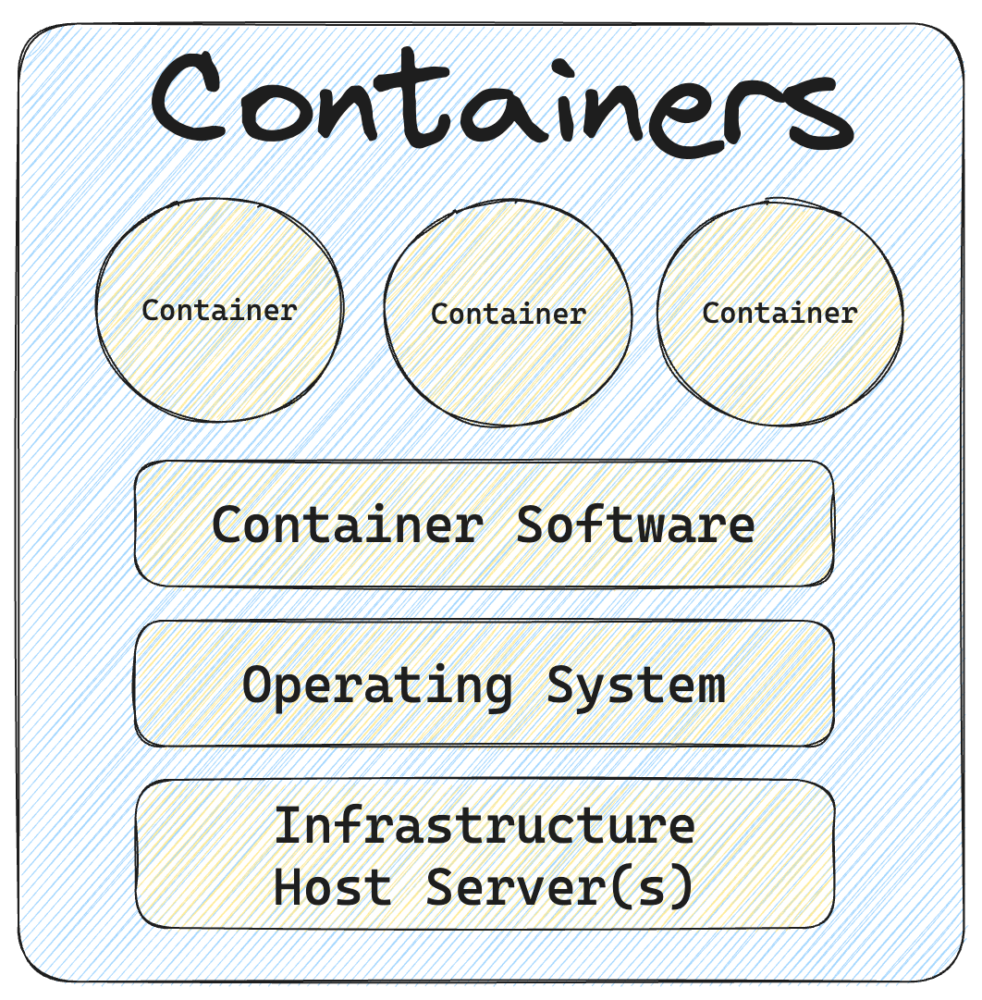

### What Are Virtual Machines (VMs)?
Virtualization enables the creation of computer-generated computers known as virtual machines (VMs). These are essentially autonomous virtual computers that run on a single set of hardware or a pool of hardware resources. Each virtual machine operates in isolation, forming a self-contained environment complete with its own virtualized hardware components, including CPU, memory, storage, and network interfaces. The role of the hypervisor is to allocate and manage these resources, ensuring equitable distribution and preventing any interference between individual VMs.

One important characteristic of VMs is that each requires its own operating system (OS). Consequently, VMs have the flexibility to run different operating systems, facilitating the coexistence of diverse software environments and applications on the same physical machine without conflicts. VMs provide a layer of isolation, safeguarding against issues or failures in one VM from affecting others sharing the same hardware. Additionally, they offer valuable advantages for testing and development purposes, as developers can create snapshots of VMs to capture specific system states for experimentation or easy rollbacks. VMs also simplify resource scaling and backup creation through the straightforward ability to migrate or clone instances.

With the advent of cost-effective virtualization technology and the availability of cloud computing services, organizations of all sizes have enthusiastically embraced VMs as a means to reduce costs and enhance operational efficiency within their IT departments.

VMs, on the other hand, can consume a significant amount of system resources. Each VM not only operates a complete copy of an operating system but also emulates a virtual representation of all the necessary hardware components required by the OS to function. This is why VMs are occasionally referred to as "monolithic," as they are self-contained units typically employed to run applications constructed as single, extensive files. (The term "monolithic" will become clearer as you explore containers further below.) This accumulation of resources, including RAM and CPU cycles, can be substantial. While VMs remain cost-effective in comparison to running separate physical computers, they may prove to be excessive for specific use cases, particularly for applications. This need for efficiency enhancement ultimately gave rise to the development of containers.

#### Benefits of VMs
- Apps have access to all available OS resources.
- Established and reliable functionality.
- Strong and effective management tools.
- Familiar security tools and controls.
- Capability to run diverse operating systems on a single physical machine.
- Cost-effective compared to maintaining separate physical machines.

#### Cons
- Iteration speed: Virtual machines are time consuming to build and regenerate because they encompass a full stack system. Any modifications to a virtual machine snapshot can take significant time to regenerate and validate they behave as expected.

- Storage size cost: Virtual machines can take up a lot of storage space. They can quickly grow to several gigabytes in size. This can lead to disk space shortage issues on the virtual machines host machine.

#### Popular VM Providers
- VMware Workstation Player
- VirtualBox
- Xen Project
- Microsoft Hyper-V

### What Are Containers?
Containers, unlike virtual machines (VMs) that virtualize an entire computer, focus solely on virtualizing the operating system (OS).

Containers are deployed on top of a physical server alongside its host OS, which is typically Linux or Windows. Each container shares the same host OS kernel and often the binaries and libraries, optimizing resource utilization. These shared components are set to read-only mode.

What makes containers more efficient? Sharing OS resources, such as libraries, significantly reduces the need to replicate the entire operating system code. As a result, a single operating system installation can support multiple workloads, making containers lightweight and highly portable. They typically only occupy megabytes in size and start within seconds. In practical terms, containers allow you to host two to three times as many applications on a single server compared to VMs. VMs, in contrast, take minutes to boot and are significantly larger, measured in gigabytes instead of megabytes compared to an equivalent container.

While container technology has been around for some time, Docker's launch in 2013 made containers the industry standard for application and software development. Technologies like Docker and Kubernetes create isolated environments for applications, resolving the issue of environment inconsistency commonly encountered in software development and deployment, often referred to as the "works on my machine" problem.

Developers typically write code on their local machines and then deploy it to a server. Any disparities between these environments—such as software versions, permissions, or database access—can lead to bugs. Containers allow developers to create a self-contained, portable unit containing all the necessary dependencies to run consistently in any environment, whether it's local, development, testing, or production. This portability is a key advantage of containers.

Containers also offer scalability, enabling the deployment and management of multiple instances of a containerized application in parallel. This allows for efficient resource allocation and the ability to adapt quickly to changing demand.

The rise of container technology also gave birth to microservices architectures for application development. Containers allowed applications to be broken down into smaller, purpose-specific components or "services" that could be developed and deployed independently, rather than in one monolithic unit.

For instance, consider an app that enables customers to purchase items worldwide. It may consist of various services, such as a search bar, a shopping cart, and a buy button. Each of these "services" can exist in its own container. If, for instance, the search bar experiences high load and encounters issues, it won't affect the entire application. This approach is what enables the smooth operation of massive digital events such as major e-commerce deals.

#### Container Tools
Linux Containers (LXC): Often referred to as LXC, this technology represents the original Linux container solution. LXC operates as a method for Linux operating system-level virtualization, allowing the execution of multiple isolated Linux systems on a single host.

Docker: Initially conceived as an effort to enhance LXC containers for individual applications, Docker brought about a revolutionary transformation in the container landscape. It introduced significant improvements to enhance the mobility and versatility of containers. Over time, Docker evolved into an independent container runtime environment and became a prominent utility in the Linux ecosystem, facilitating the effortless creation, transportation, and execution of containers with exceptional efficiency.

Kubernetes: While not a container technology in itself, Kubernetes assumes a pivotal role as a container orchestrator. In the realm of cloud-native architecture and microservices, where applications deploy numerous containers—ranging from hundreds to thousands or even billions—Kubernetes automates the comprehensive management of these containers. While Kubernetes relies on complementary tools like Docker for seamless operation, its significance in the container space is so substantial that it deserves mention in any discussion about containers.

#### Benefits of Containers
- Reduced IT management resources.
- Faster spin ups.
- Smaller size means one physical machine can host many containers.
- Reduced and simplified security updates.
- Less code to transfer, migrate, and upload workloads.

#### Cons:
- Shared host exploits: Containers all share the same underlying hardware system below the operating system layer, it is possible that an exploit in one container could break out of the container and affect the shared hardware. Most popular container runtimes have public repositories of pre-built containers. There is a security risk in using one of these public images as they may contain exploits or may be vulnerable to being hijacked by nefarious actors.
