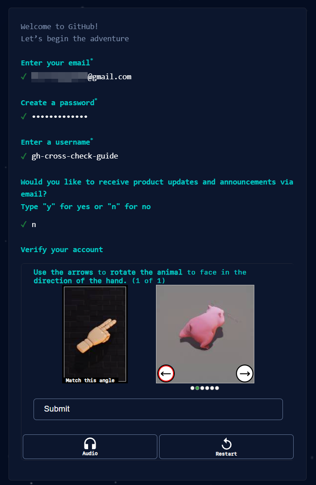

# How to create GitHub repository and add evidence of completing task to it

## Register GitHub account

1) Open in your browser https://github.com/.  
2) Click "Sign Up" button in right top corner.  
  
3) Enter your e-mail, click "Continue", enter your password, click "Continue", enter your username, click "Continue", answer the question - you could type "n", click "Continue". Click "Verify", solve a puzzle and click "Submit". After that click "Create account" button.  
  
4) Check your e-mail inbox for GitHub launch code.  
  
5) Open e-mail and click "Open GitHub" button or link down below  
  
6.1) Enter code from e-mail to the form.  
  
6.2) Registration is completed  
  

